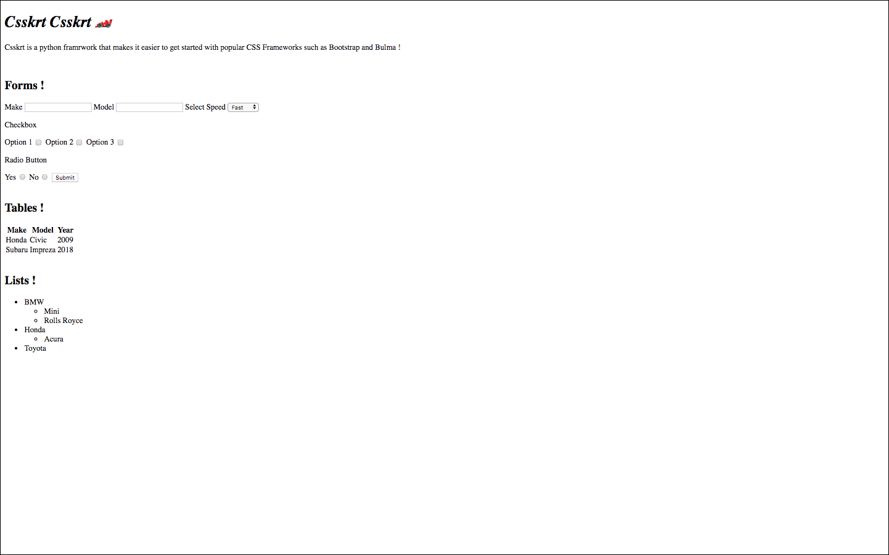
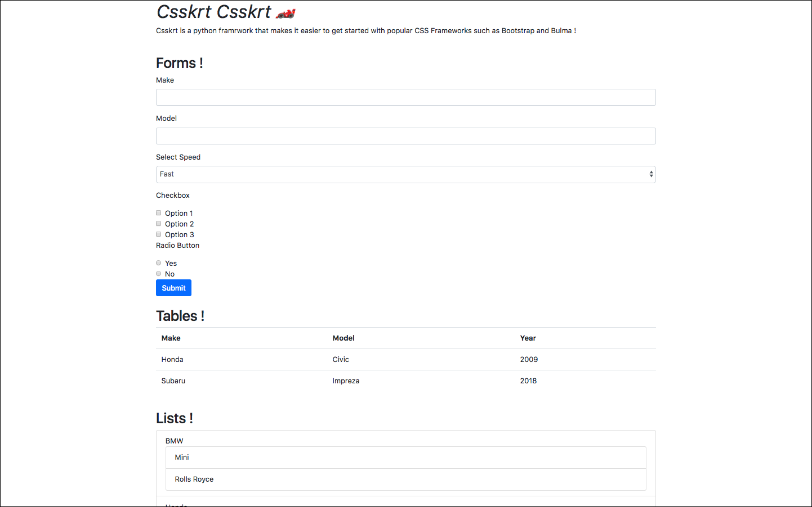
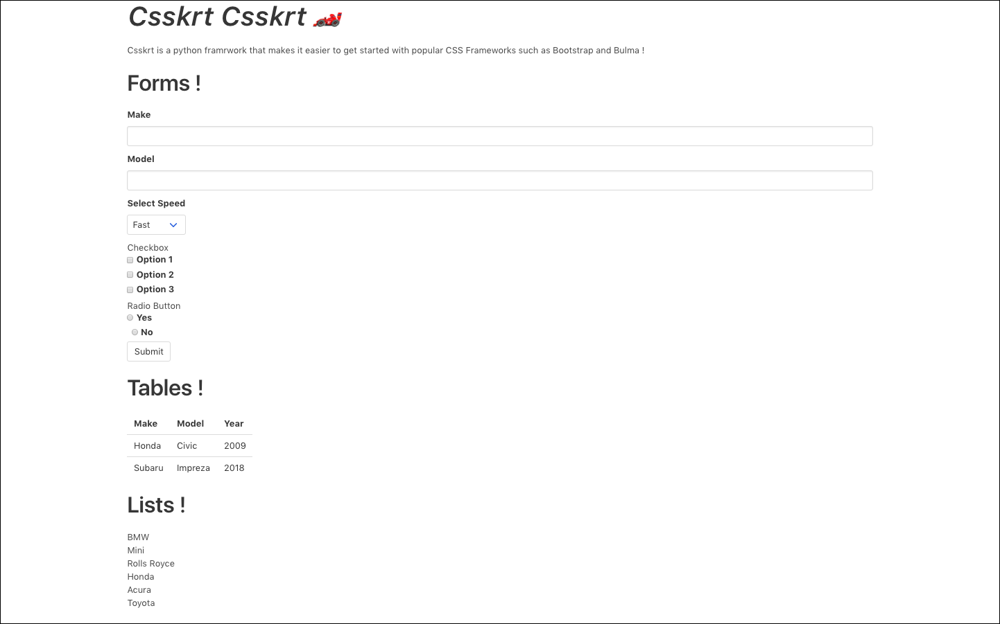

# _CSSKRT CSSKRT_
Csskrt-csskrt is a python module for automatically adding css styles for popular frameworks such as Bootstrap and Bulma 
to make them more visually appealing and make it faster to get started with them.

## Supported Frameworks
<a href="https://getbootstrap.com/docs/4.1/getting-started/introduction/" target="_blank">
    
</a>

<a href="https://bulma.io/documentation/" target="_blank">
    
</a>

## Quick install
```pip install csskrt```

## Usage
To run the program, type:

```$ csskrt --help```

## Contributing
All feedback and suggestions are welcome, just post an issue!

## License
This project is distributed under the [MIT](LICENSE.txt) license.

## Demo 
#### Original


#### Bootstrap

    
#### Bulma

